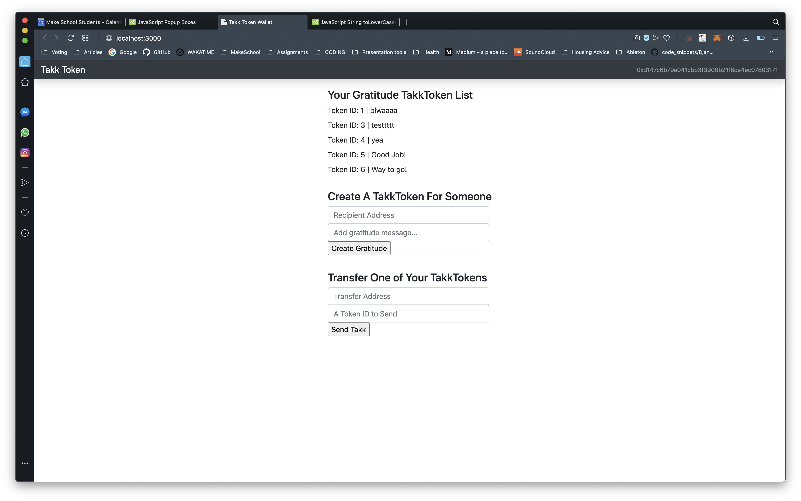
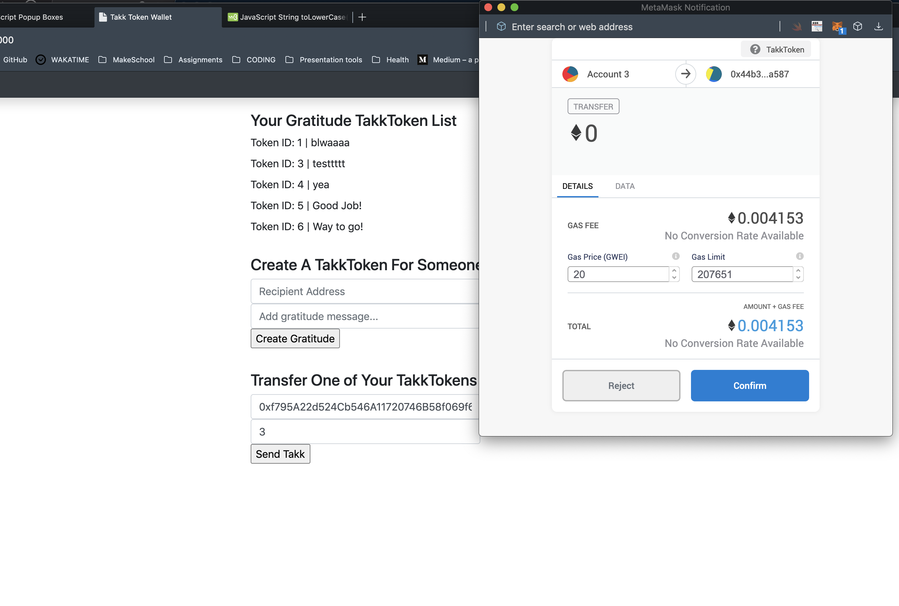
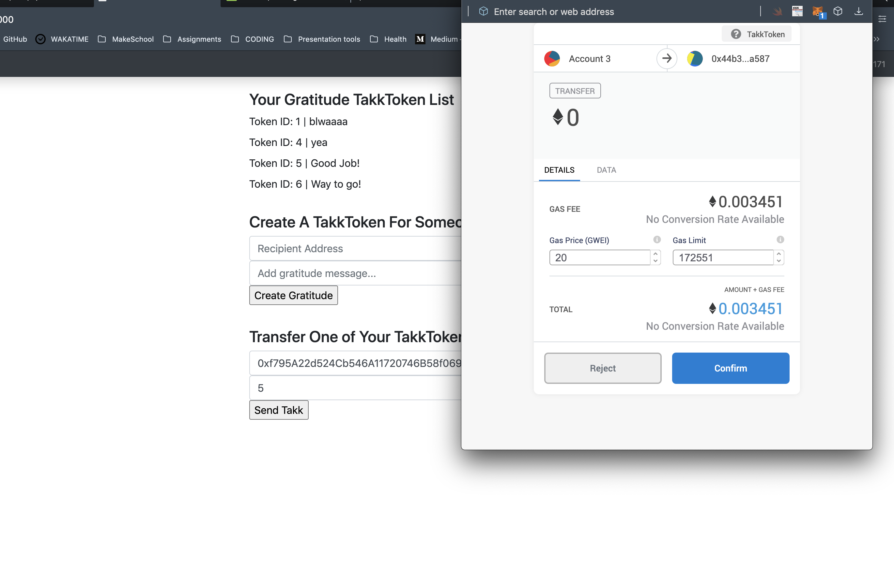
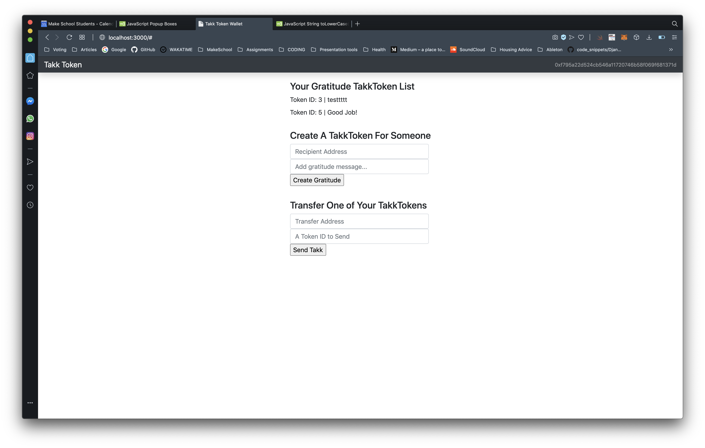
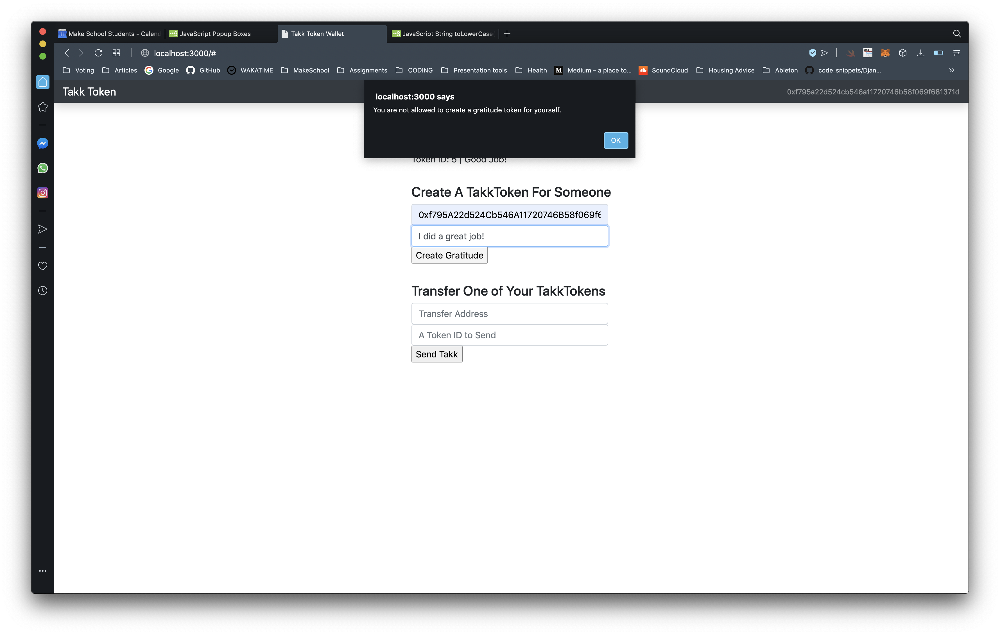

# Takk Token ```coming-soon```

 Blockchain app using `Etherium` Smart Contracts, `Solidity`, and `ERC721`. 
 
 `Takk` is an ERC721 token that represents a moment of gratitude shared between two people. 
 
 A user(Q) who does a good deed receives 1 Takk as gratitude for the deed from another user(T). The user who did the good deed(Q) now has 1 Takk in their wallet and can use their `Takk` to pay other users as gratitude when the situation arises.
 (i.e. T paid Q 1 Takk for doing something good)

### Features to Look Forward to: 

- [ ] **Second token feature** :  `Hafna` can be sent to users who do *bad deeds*
- [ ] `Hafna` will automatically remove 20% of user's `Takk`, then continues to remain in the user's account for 3 days
- [ ] During the 3 days, if more `Takk` is recieved while `Hafna` is present, 50% of the `Takk` will automatically be sent to the user who originally sent the `Hafna` (i.e. Q received a `Hafna` from T, now Q pays T 50% of `Takk` recieved in the following 3 days)
- [ ] Users can exchange x `Takk` to buy 1 `Hafna` to send to another

## Prerequisites

- [npm](https://www.npmjs.com/get-npm)
- [NodeJS](https://nodejs.org/en/download/)
- [Ganache](https://www.trufflesuite.com/ganache)
- [MetaMask](https://metamask.io/)
- Install <strong>*OpenZeppelin*</strong> with ```$ npm install @openzeppelin/contracts```
- Update <strong>*Truffle*</strong> using ```$ npm update -g truffle```

## Connecting Ganache to Metamask

Follow this tutorial to see how to properly connect Ganache to your Metamask.
[Click Here for the written tutorial](https://steemit.com/ganache/@matbest/setting-up-ganache-and-metamask-on-my-windows-10-home-laptop).

## To run the project code:

- Run ```$ npm install```
- Run ```$ truffle migrate --reset```
- Run ```$ npm run dev```

## Demo

Example of a User's webpage with gratitude tokens in their wallet.

Sending/transfering a gratitude token ID 3 in my wallet.

Sending/transfering a gratitude token ID 5 in my wallet.

My list of gratitude tokens after sending/transfering desired tokens.

View of the receiver's webpage.

Error message received upon attempting to create a token on your own account.
(You are not allowed to create a token on your account, only on other users' account)


## Steps for Setup & Contribution 

1.  Clone this repo 

    ```bash
    $ cd <location where you would like repo stored>

    $ git clone https://github.com/ellojess/Takk-Token.git

    ```

2. Make sure it is setup correctly 

    ```bash
    $ cd Takk-Token

    $ git remote -v

    ```
        
    You should see: 

        origin    https://github.com/ellojess/Takk-Token.git (fetch)
        origin    https://github.com/ellojess/Takk-Token.git (push)
        
3. Run the following command

    ```bash

    $ npm install

    ```
        
4. Create your own branch to make edits on 

    ```bash

    $ git checkout -b <your name/feature>

    ```
        
5. Set upstream 

    ```bash

    $  git push --set-upstream origin <branch name you setup in step 3 above>

    ```

You should now be able to push as you normally would through terminal

After you push from terminal, go to this repo and submit a pull request when you're ready. 


## Contributors 

[Cao Mai](https://github.com/caocmai)

[Jessica Trinh](https://github.com/ellojess)

[Kento Murata](https://github.com/kmurata798)
